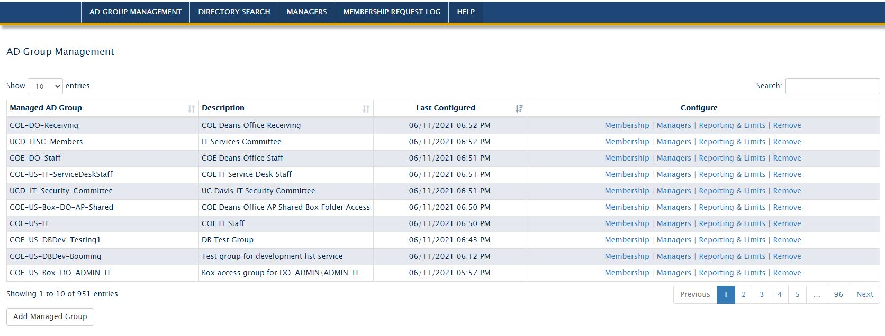

## Active Directory Group Management Talk

A discussion about the development of a tool that allows users to manage the membership of assigned AD groups.

### Background

Our unit started heavily using AD groups for access to cloud services, facilities, labs, licensed software, and email list membership. Historically, users would submit support tickets for AD group membership changes.   

### Requirements

1. Allow users to change direct membership of a group
2. Not allows users to remove nested AD groups or child domain users
3. Bulk adds and removes
4. Reporting for users that sends reminders of groups managed and their membership
5. Users can receive individual report or summary of all groups managed
6. Provisioning completion notices to users and all managers of AD group
7. Limit group membership count. Including nested members
8. Delegated admin access for department admins based up AD group DN

### Features

#### Admin View

#### User View

Seeing how this looks

