## Active Directory Group Management Talk

A discussion about the development of a tool that allows users to manage the membership of assigned AD groups.

### Background

Our unit started heavily using AD groups for access to cloud services, workstations, facilities, labs, licensed software, and email list membership. Historically, users would submit support tickets for AD group membership changes.   

### Requirements

- Allow users to change direct membership of a group
- Not allows users to remove nested AD groups or child domain users
- Bulk adds and removes
- Reporting for users that sends reminders of groups managed and their membership
- Users can receive individual report or summary of all groups managed
- Provisioning completion notices to users and all managers of AD group
- Limit group membership count. Including nested members
- Delegated admin access for department admins based up AD group DN

### Configuration

- \.NET MVC website for submitting requests and configuring automation options
- \.NET console application for processing requests and other automated tasks
- MS SQL database for storing application data
- Frontend application pool runs under a regular AD account\. No access to modify AD group membership

### Features

#### Roles

The application is based upon three levels of access:

- Admin
  - Add, remove, and configure all groups
  - Add, remove, and configure all managers
  - View membership request log
- Department Admin
  - Add, remove, and configure all groups under their associated OU assignments\. Based upon match with DN partials of the requested group\'s DN 
  - Add, remove, and configure all managers
  - View membership request log
- Manager
  - Add and remove members from directly assigned AD groups

#### Admin View

Both admin and department admins will be presented a list of all the AD groups in the application. This view allows admins to change a group's membership, manager assignments, configure the group's app settings, and if necessary remove the group. 

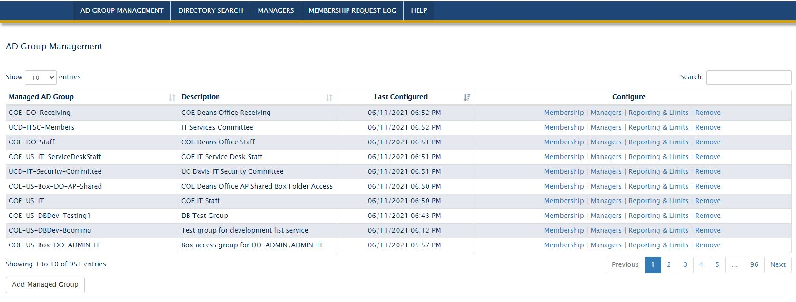

#### Manager View

Managers only see a list of directly assigned groups they can manage. 

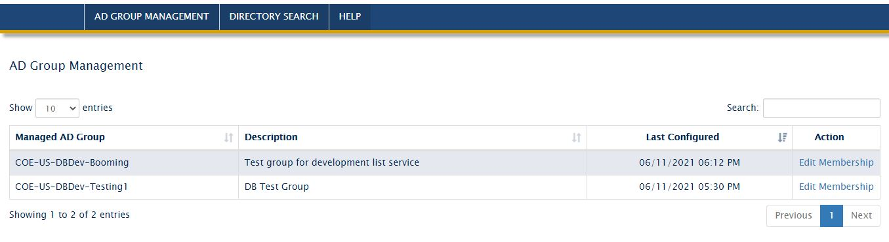

#### Changing Membership 

When viewing a group's membership, managers can see current members and any pending requests. Requests are processed by a backend process that runs every few minutes. 

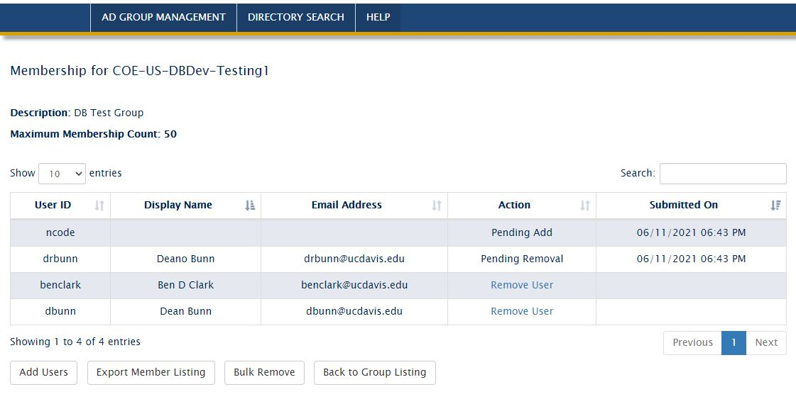

#### Adding Members

Add members feature should allow managers to submit a list of new members. We chose to lookup users by user ID or email address \(or a mixture of both\)   

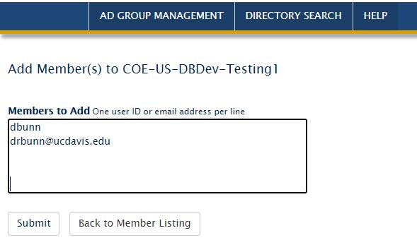

#### Directory Search

Managers might not know the user ID or email address of the member, so we added a directory search feature.

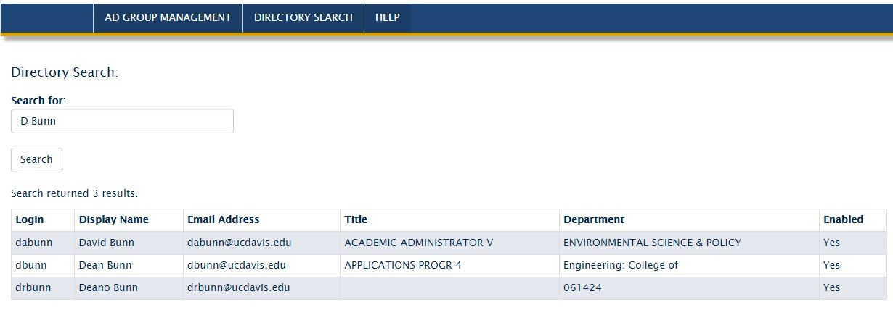

#### Bulk Removes

Besides having a way to remove an individual user, managers quickly requested the ability to remove all members, or numerous users, in one submission.

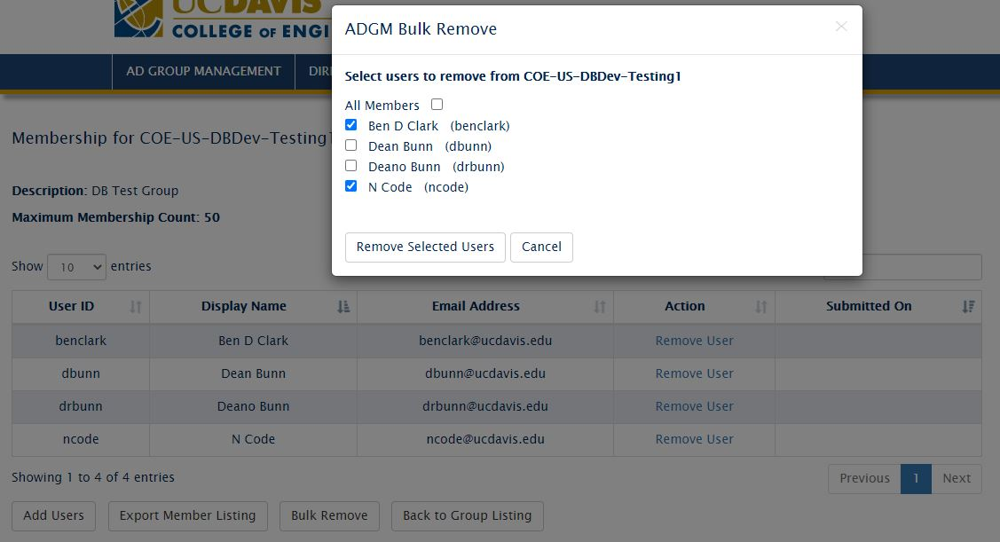

#### Membership Reports and Change Notifications

Reporting of group membership can be configured by the individual group or by the manager \(receives all their managed groups memberships at once\).  

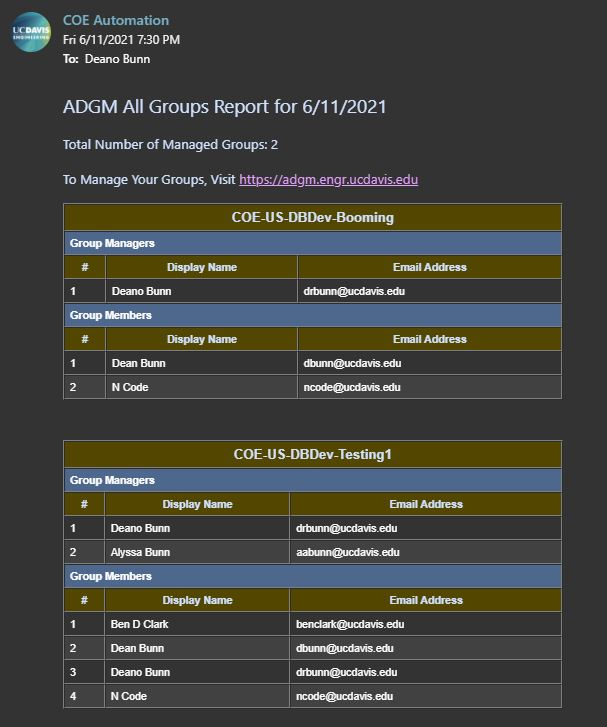

As an added security feature, a group can be configured to send completion notices after membership requests are processed. Notices go out to all managers of the group and if selected an additional email address.

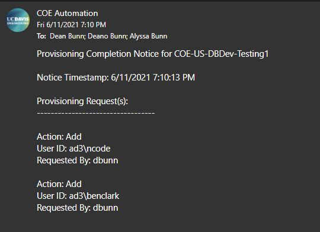

#### Managers Listing

The managers listing allows admins and department admins a quick way to view all managers and their manage group count. Links are provided to display their associated groups and change a manager\'s reporting settings.

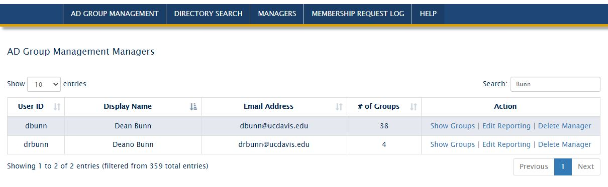

#### Manager\'s Groups

Showing a view of all the groups a manager became essential when auditing access permissions and adding additional managers.

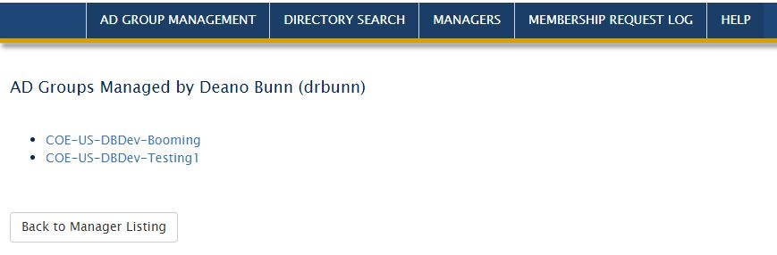

#### Manager Report Settings

For those managers that wanted one report for all their groups at once, we added options for amount of days between reports and to reset the report timer.

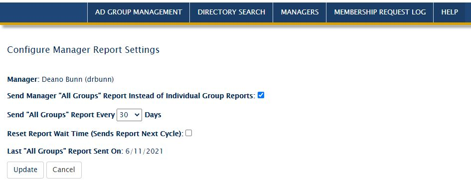

#### Group Settings

Providing options each group\'s membership reporting, change notices, admin account restrictions, membership count, and group description allowed department admins a granular level of control and functionality.

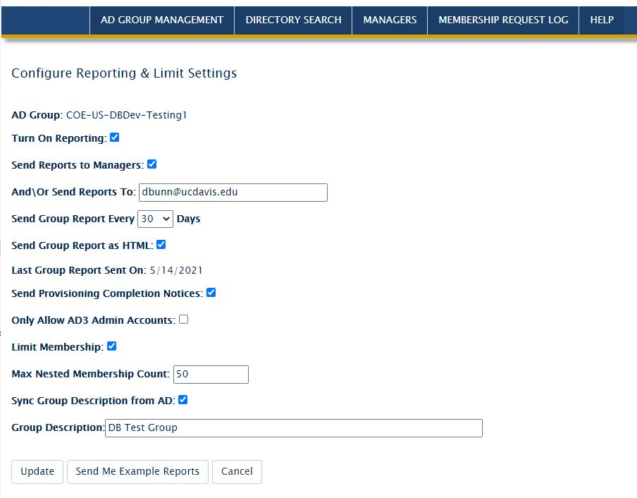

#### Membership Request Log

Having a quickly searchable log of all membership requests \(with who requested them and the time completed\) processed by the application assisted with support tickets for onboarding, offboarding, and access issues.  

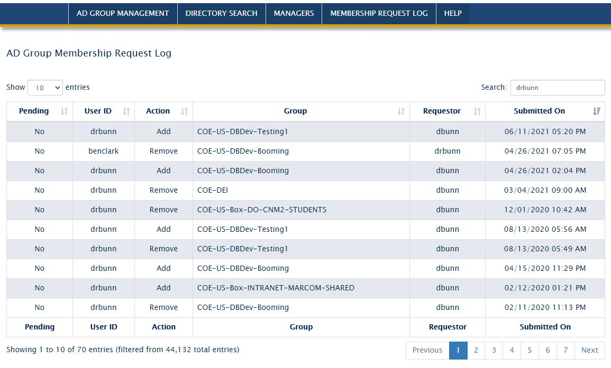

